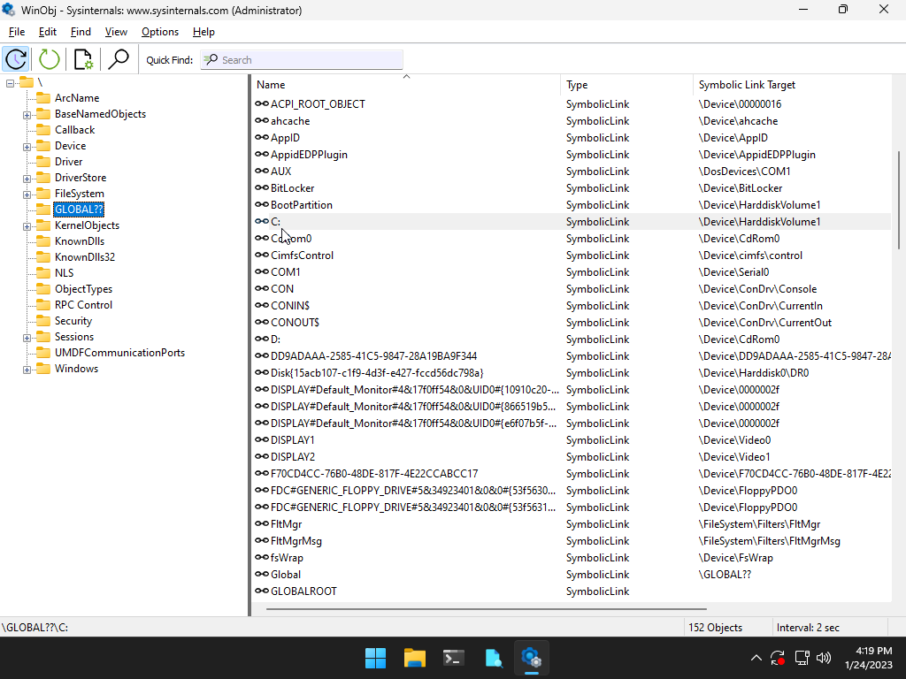

---
title: "Tworzenie plików w systemie Windows"
author: [Błażej Smorawski]
date: "2023-01-24"
keywords: [Markdown, Windows]
...

# Jak system Windows tworzy pliki?

Celem tego sprawozdania jest zaprezentowanie elementów systemu _I/O_ biorących udział w tworzeniu pliku. Ułatwimy proces badania tego zjawiska poprzez dodanie do niego jednego filtra, który będzie widoczny jak instancja sterownika _FltMgr_.

Aby prześledzić ten proces wyobraźmy sobie, że program użytkownika wykonuje wywołanie w postaci:

```c
hFile = CreateFile("C:\\plik.txt",          // name of the write
                    GENERIC_WRITE,          // open for writing
                    0,                      // do not share
                    NULL,                   // default security
                    CREATE_NEW,             // create new file only
                    FILE_ATTRIBUTE_NORMAL,  // normal file
                    NULL);                  // no attr. template
```

> Warto zwrócić w tym miejsu uwagę, że funkcja _CreateFile_ nie otwiera tylko plików w kontekście systemu plików, ale też _wirtualne pliki_, które reprezentują różnego rodzaju urządzenia fizyczne bądź logiczne. Przykładem takiego, będzie przedstawione później urządzenie _Ntfs_.

## Podejście początkowe

Mając podstawową wiedzę na temat funkcji _I/O managera_ systemu _Windows_ możemy się spodziewać, że wywołanie _CreateFile_ spowoduje stworzenie odpowiedniego _IRP_ (_Interrupt Request Packet_), które zostanie przekazane do urządzenia obsługującego ścieżkę _C:\\plik.txt_.

Korzystając z narzędzia _WinObj_ z pakietu _sysinternals_ możemy sprawdzić w jaki sposób jest rozwijana ścieżka zaczynająca się od _C:\\_ korzystając z tablicy _GLOBAL??_.



Możemy zobaczyć, że _C:\\_ jest rozwijane do _\\Device\\HarddiskVolume1_. Teraz możemy sprawdzić jakie sterowniki będą obsługiwać to przerwanie. Zakładając, że jest to model warstwowy wykorzystamy komendę _!devstack_ w _WinDbg_, która wyświetla stos tych sterowników.

```
0: kd> !devstack HarddiskVolume1
  !DevObj           !DrvObj            !DevExt           ObjectName
  ffffdb0586707030  \\Driver\\volsnap    ffffdb0586707180  
  ffffdb05865c3d20  \\Driver\\volume     ffffdb05865c3e70  
  ffffdb05866078d0  \\Driver\\rdyboost   ffffdb0586607a20  
  ffffdb05866098d0  \\Driver\\iorate     ffffdb0586609a20  
  ffffdb0586705030  \\Driver\\fvevol     ffffdb0586705180  
> ffffdb058660e8f0  \\Driver\\volmgr     ffffdb058660ea40  HarddiskVolume1
```

Ta obserwacja może być dla nas zaskoczeniem - na powyższym stosie nie ma żadnego sterownika związanego z systemem plików czy fizycznym urządzeniem dyskowym. Jest to spowodowane tym, że przypisanie woluminowi litery - w tym przypadku _C_ - nie wiąże się z powiązaniem go z systemem plików. 

## Dalsza obsługa przerwania IRP_MJ_CREATE

Aby dowiedzieć się, jaki system plików obsługuje ten wolumin, musimy skorzystać z widocznego powyżej sterownika _volmgr_, który zbada strukturę nazywaną _volume parameter block_ (_VPB_).

Wszystkie _IRP_ zawierajace ścieżki do plików na danym urządzeniu skierowane do _volmgr_ są przekierowywane (poprzez ponowne wykorzystanie _IRP_ lub stworzenie nowego) do odpowiedniego sterownika systemu plików.

Możemy przyjrzeć się temu procesowi za pomocą komendy _!drvobj volmgr_, która służy do badania sterowników i przedstawia nam dostępne informacje na ich temat.

```
0: kd> !drvobj volmgr
Driver object (ffff960c40734e10) is for:
 \Driver\volmgr

Driver Extension List: (id , addr)

Device Object list:
ffff960c40860870  ffff960c4073aba0  
```

Upraszczając, pierwszy _device object_ w powyższej liście reprezentuje nasz wolumin _C_, a drugi to urządzenie kontrolne _volmgr'a_. Następnym krokiem będzie zbadanie tego obiektu:

```
0: kd> !devobj ffff960c40860870
Device object (ffff960c40860870) is for:
 HarddiskVolume1 \Driver\volmgr DriverObject ffff960c40734e10
Current Irp 00000000 RefCount 40417 Type 00000007 Flags 00201150
Vpb 0xffff960c408d5ab0 SecurityDescriptor ffffba0bda859060 DevExt ffff960c408609c0 DevObjExt ffff960c40860b88 Dope ffff960c408d5180 DevNode ffff960c40860c20 
ExtensionFlags (0x00000800)  DOE_DEFAULT_SD_PRESENT
Characteristics (0x00020000)  FILE_DEVICE_ALLOW_APPCONTAINER_TRAVERSAL
AttachedDevice (Upper) ffff960c408ef030 \Driver\fvevol
Device queue is not busy.
```

W wyniku wykonania tej opracji, poznaliśmy uchwyt do struktury _VPB_ naszego woluminu, który możemy zbadać poleceniem _!vpb_:

```
0: kd> !vpb 0xffff960c408d5ab0
Vpb at        0xffff960c408d5ab0
Flags:        0x1 mounted 
DeviceObject: 0xffff960c4099f030 (dt nt!DEVICE_OBJECT)
RealDevice:   0xffff960c40860870 (dt nt!DEVICE_OBJECT)
RefCount:     40417
Volume Label: ""
```

To polecenie zwraca nam między innymi uchwyt na _DeviceObject_, który reprezentuje urządzenie do którego dalej zostanie przekazane wysłane przez nas _IRP_. Możemy je zbadać poleceniem _!devstack_:

```
0: kd> !devstack ffff960c4099f030
  !DevObj           !DrvObj            !DevExt           ObjectName
  ffff960c40847d20  \FileSystem\FltMgr ffff960c40847e70  
> ffff960c4099f030  \FileSystem\Ntfs   ffff960c4099f1b0  
```

Udało się nam to, czego oczekiwaliśmy na samym początku - odwołanie do sterownika _Ntfs_ oraz wspomnianego na początu górnego filtra _FltMgr_. Kolejnym etapem przetwarzania tego żądania będzie wysłanie nowego _IRP_ do sterownika _volmgr_ przez sterownik _Ntfs_, ale tym razem korzystającego z interfejsu blokowego tego urządzenia zamiast dostępu do danego pliku jak miało to miejsce wcześniej. 

**Prawdopodobnie** będzie to miało miejsce poprzez wywołanie _IoCreateFile_, _IoCreateFileSpecifyDeviceObjectHint_, _ZwCreateFile_, lub _ZwOpenFile_, którego celem będzie teraz _\\Device\\HarddiskVolume1_ - w przeciwieństwie do _\\Device\\HarddiskVolume1\\plik.txt_, które _volmgr_ otrzymał na samym początku oraz różnego rodzaju operacje odczytu i zapisu na poziomie blokowym.

Ostatnim etapem będzie wysłanie przerwania do sterownika dysku. Możemy sprawdzić, jak będzie wyglądała jego obsługa. Wiemy, że urządzenie reprezentujące dysk, na którym jest wolumin _C_ to _\\Device\\Harddisk0\\DR0_. Na tej podstawie:

```
0: kd> !devstack Harddisk0\\DR0
  !DevObj           !DrvObj            !DevExt           ObjectName
  ffffdb058661d8d0  \\Driver\\partmgr    ffffdb058661da20  
> ffffdb0586663060  \\Driver\\disk       ffffdb05866631b0  DR0
  ffffdb0586531050  \\Driver\\storahci   ffffdb05865311a0  00000029
!DevNode ffffdb0586536af0 :
  DeviceInst is "SCSI\\Disk&Ven_VBOX&Prod_HARDDISK\\4&2617aeae&0&000000"
  ServiceName is "disk"
```

## Podsumowanie
Na podstawie naszego małego _"dochodzenia"_ możemy dojść do wniosku, że proces tworzenia pliku w systemie _Windows_ wygląda następująco:

 1. Wywołanie _CreateFile_ korzystające ze ścieżki _C:\\plik.txt_
 2. Stworzenie _IRP_ typu _IRP\_MJ\_CREATE_ do urządzenia _\\Device\\HarddiskVolume1_
 3. Obsługa _IRP_ przez sterownik _volmgr_
 4. Wysłanie _IRP_ do urządzenia _Ntfs_
 2. Stworzenie _IRP_ opisującego operacje blokowe potrzebne do utworzenia pliku w systemie plików _Ntfs_. I wysłanie go do urządenia _\\Device\\HarddiskVolume1_ 
 3. _volmgr_ wysyła żądanie zapisu na fizycznym dysku _\\Device\\Harddisk0\\DR0_.


## Źródła

 * Windows Internals, Part 1,2 (Developer Reference) - Russinovich, Mark; Allievi, Andrea; Ionescu, Alex; Solomon, David

## Kontakt

 * https://github.com/blazej-smorawski/windows-package-manager-report